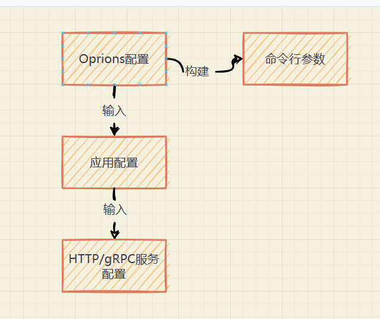
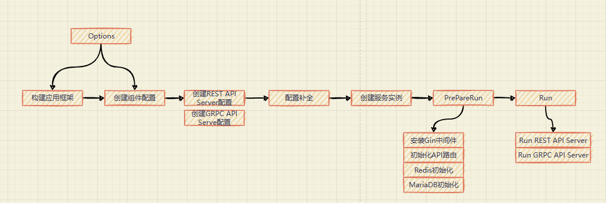

## apiserver 配置处理
总共有三种配置：Options配置、应用配置、HTTP/gRPC服务配置

+ **Options**：用来构建命令行参数、它的值来自命令行选项或者配置文件；
Options可以用来构架应用框架，也是应用配置的输入
+ **应用配置**：apiserver组件中需要的一切配置。
启动HTTP/gRPC需要配置的监听地址和端口，初始化数据库需要配置数据库地址、用户名或者密码
+ **Http/gRPC**：启动HTTP服务或者GRPC服务需要的配置

3中配置相互独立，课解耦命令行选项、应用和应用内的服务，使得3各部分独立扩展，又互不影响

## 服务启动流程
应用的启动流程设计

